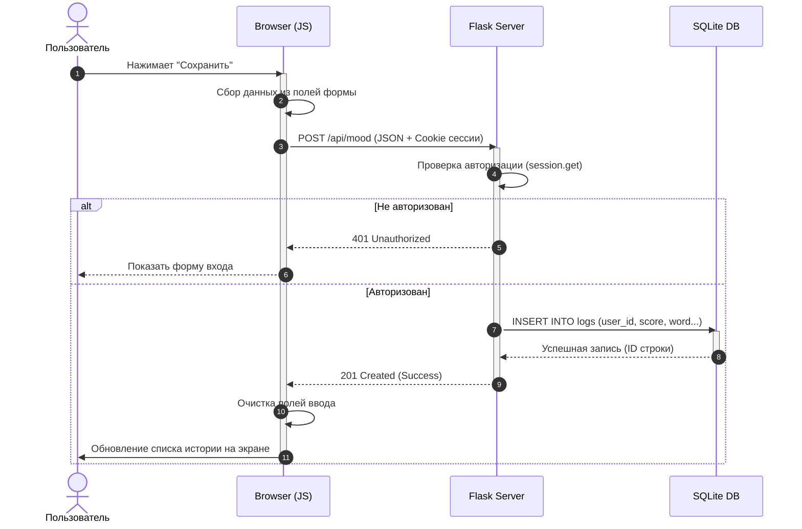

# Диаграмма последовательности (Sequence Diagram)

Этот документ визуализирует взаимодействие между компонентами системы при выполнении ключевых операций.

## Процесс сохранения записи настроения

Ниже показано, как данные проходят путь от нажатия кнопки в браузере до сохранения в файле базы данных.

## Пояснения к этапам:
1. **Cookie сессии (шаг 3)**: Браузер автоматически прикрепляет куки к запросу, чтобы Flask понял, какой именно пользователь пишет в дневник.
2. **Асинхронность**: Пока Flask общается с базой данных (шаги 6-7), браузер «ждет» ответа (именно поэтому мы используем `await fetch`).
3. **Обработка ошибок**: Если база данных будет занята или недоступна, цепочка прервется на шаге 7, и сервер вернет ошибку 500.
