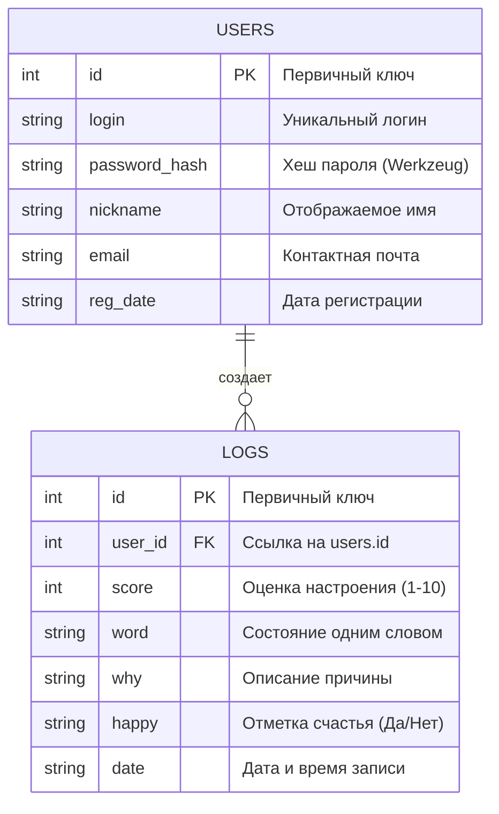

# Схема базы данных Mood Tracker

Проект использует реляционную базу данных **SQLite**. Связь между таблицами реализована через внешний ключ (`user_id`), что обеспечивает изоляцию данных каждого пользователя.

## ER-диаграмма (Entity Relationship)

## Описание связей
- **Один ко многим (1:N)**: Один пользователь может иметь неограниченное количество записей в дневнике.
- **Целостность**: При удалении пользователя (в будущих версиях) связанные записи в `logs` должны обрабатываться согласно политике `ON DELETE CASCADE`.

## Индексы (Планируемое)
Для оптимизации поиска по истории планируется добавление индекса на поле `user_id` в таблице `logs`.
