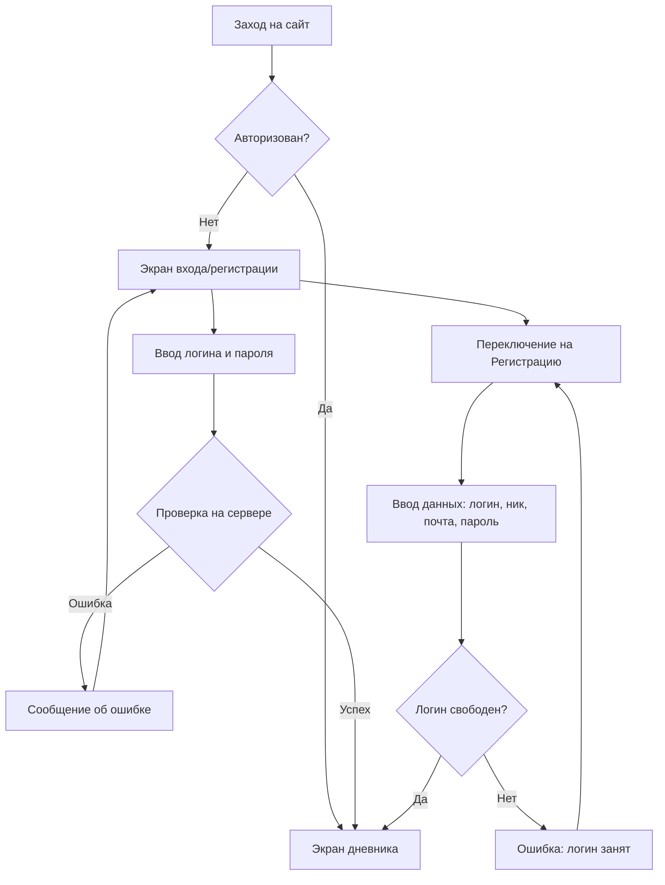
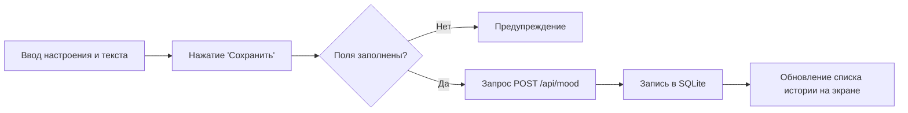
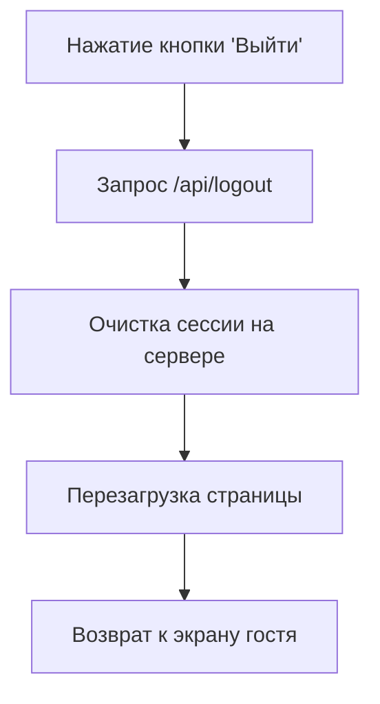

# Пользовательские сценарии (User Flow)

Этот документ описывает логику взаимодействия пользователя с интерфейсом приложения Mood Tracker.

## 1. Сценарий: Вход и Регистрация

Диаграмма показывает процесс от момента захода на сайт до получения доступа к личному дневнику.

## 2. Сценарий: Сохранение записи

Логика работы основной функции приложения после авторизации.

## 3. Сценарий: Выход из системы

